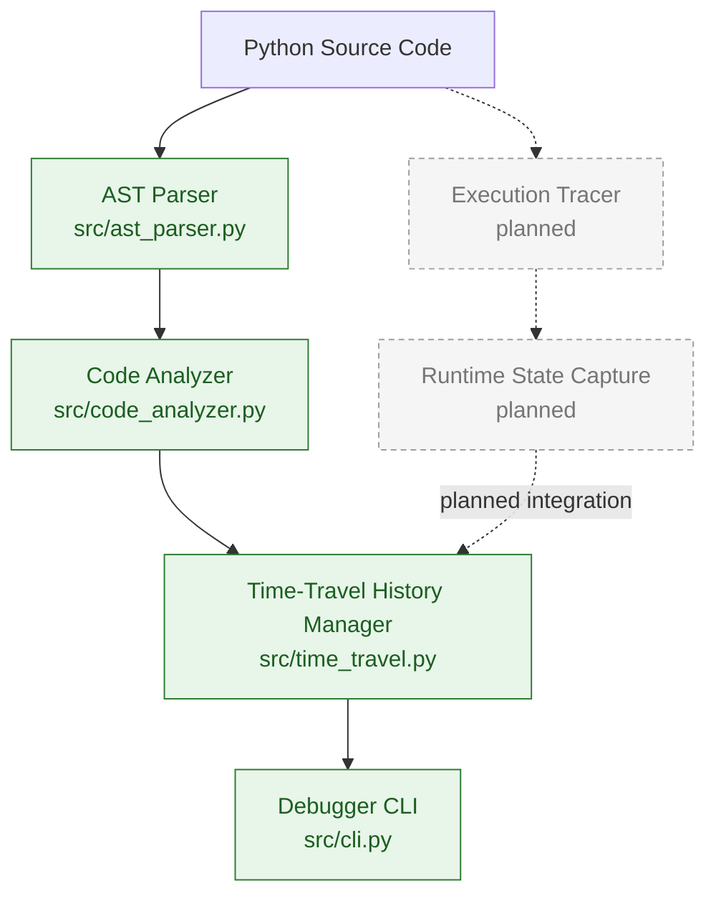
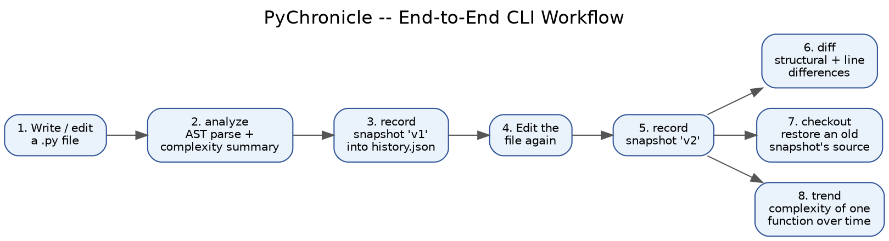
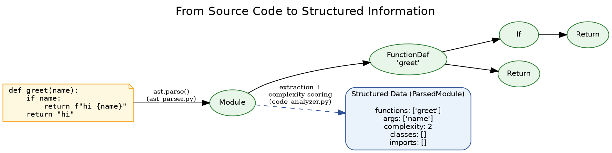
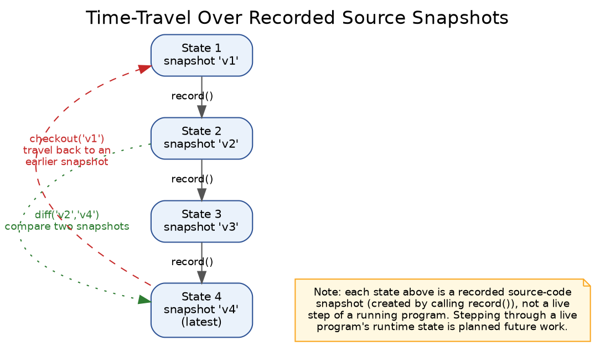

# PyChronicle

### AST-Powered Time-Travel Debugger for Python

PyChronicle is a Python toolkit that parses source code with Python's
built-in `ast` module, analyzes its structure and complexity, and keeps a
navigable history of how a file changes over time. A command-line
interface ties these pieces together so a developer can analyze a file,
record its state, keep editing, and then compare, restore, or trace the
complexity of any earlier recorded version.

> **Scope note:** PyChronicle's "time travel" currently operates over
> **recorded source-code snapshots** (versions of a file you explicitly
> save with the tool), not over the live runtime state of a running
> program. A runtime execution tracer — which would let you step through
> and inspect variable state *while a program is executing* — is a
> **planned feature** and is not implemented yet. This distinction is
> called out throughout this document wherever it matters.

---

## Table of Contents

1. [Project Overview](#project-overview)
2. [Key Features](#key-features)
3. [Architecture](#architecture)
4. [How PyChronicle Works](#how-pychronicle-works)
5. [AST-Based Code Analysis](#ast-based-code-analysis)
6. [Time-Travel Debugging Concept](#time-travel-debugging-concept)
7. [Example / Demonstration](#example--demonstration)
8. [CLI Usage](#cli-usage)
9. [Project Structure](#project-structure)
10. [Installation & Setup](#installation--setup)
11. [Running the Project](#running-the-project)
12. [Testing](#testing)
13. [Team Contributions](#team-contributions)
14. [Git & Collaboration Workflow](#git--collaboration-workflow)
15. [Technologies Used](#technologies-used)
16. [Project Status](#project-status)
17. [Future Improvements](#future-improvements)
18. [Learning Outcomes](#learning-outcomes)
19. [License](#license)

---

## Project Overview

When debugging normally, a developer runs a program and sees only its
**current** state. If something looks wrong, figuring out *what the code
or data looked like a few steps earlier* usually means adding print
statements, re-running the whole program, or scrolling back through
editor undo history — none of which give a structured, comparable record
of what actually changed.

PyChronicle addresses a narrower but related problem: understanding how a
**piece of source code itself** evolves over time. It combines:

- **Static source-code analysis** — parsing a file with Python's `ast`
  module to extract its functions, classes, imports, and a cyclomatic
  complexity score for every function.
- **Snapshot history** — recording versions of a file as labeled
  snapshots, each one re-analyzed and hashed.
- **Time-travel navigation** — comparing any two snapshots (structurally
  and line-by-line), restoring the exact source of an old snapshot, and
  tracking how one function's complexity changed across the whole
  history.
- **A command-line interface** that exposes all of the above as simple,
  scriptable commands.

This is useful for understanding *when* a function became more complex,
*what* changed between two versions of a file, or *recovering* an earlier
version without relying on a separate version-control system.

Full, live execution tracing (observing variable values and control flow
*while a program runs*, then time-travelling through that execution) is
the long-term goal referenced in the project's name, but is **not yet
implemented** — see [Project Status](#project-status).

---

## Key Features

Implemented and verified against the current codebase:

- **Python AST parsing** — `src/ast_parser.py` uses the standard-library
  `ast` module to parse a file or string into a structured
  `ParsedModule`.
- **Function, class, and import detection** — functions (including
  `async def`), classes with their methods, and both `import` and
  `from ... import` statements are extracted with line numbers,
  arguments, decorators, and docstrings.
- **Static code complexity analysis** — `src/code_analyzer.py` computes a
  cyclomatic complexity score for every function and reports counts of
  functions, classes, and imports, plus the single most complex function.
- **Source snapshot history** — `src/time_travel.py` records labeled
  snapshots of a file's source, each independently parsed and analyzed.
- **Structural + line diffing** — comparing two snapshots reports added
  and removed functions, classes, and imports; per-function complexity
  deltas; and a standard unified line diff.
- **Time-travel navigation** — restoring (`checkout`) the exact source of
  any earlier snapshot, and tracking one function's complexity across the
  entire recorded history (`complexity_trend`).
- **Persistent history** — snapshot history can be saved to and reloaded
  from a JSON file.
- **Command-line interface** — `src/cli.py` exposes `analyze`, `record`,
  `timeline`, `diff`, `checkout`, and `trend` as subcommands with clear
  error handling.
- **Automated test suite** — 69 passing tests (`pytest`) covering the
  parser, analyzer, history manager, and every CLI command (see
  [Testing](#testing)).

**Planned, not yet implemented** (see [Future Improvements](#future-improvements)):

- Execution tracer for observing a program's actual runtime behavior.
- Runtime state/variable snapshots captured *during* program execution.
- Time-travel navigation through live execution steps (as opposed to
  manually recorded source snapshots).

---

## Architecture

The diagram below shows how the implemented components connect, and
where the planned runtime-tracing components would plug in.


*Figure 1 — Solid green boxes are implemented and covered by tests.
Dashed grey boxes in the "Runtime Execution" section are planned and not
part of the current codebase.*

The same structure, as a Mermaid diagram:



---

## How PyChronicle Works

PyChronicle's workflow is entirely built around **explicitly recorded
snapshots of source code**, driven through the CLI:

1. **The user provides a Python file.** Any `.py` file can be analyzed or
   recorded.
2. **The AST parser analyzes the source structure.** `ast.parse()` builds
   a syntax tree; `src/ast_parser.py` walks it to extract functions,
   classes, methods, imports, and docstrings. A syntax error is reported
   immediately and nothing is recorded.
3. **The code analyzer computes complexity.** `src/code_analyzer.py`
   walks each function's AST node and counts decision points (`if`,
   `for`, `while`, `try`, boolean operators, and similar) to produce a
   cyclomatic complexity score.
4. **A snapshot is recorded.** `src/time_travel.py` stores the file's
   full source text together with its analysis results (function
   complexities, class list, import list) under a label, and computes a
   hash of the content.
5. **The history manager keeps every snapshot in order.** Snapshots can
   be listed (`timeline`), compared (`diff`), restored (`checkout`), or
   used to trace one function's complexity over time (`trend`).
6. **The CLI provides the user-facing interface** for every step above —
   see [CLI Usage](#cli-usage).

This is a **static, file-level** workflow: PyChronicle analyzes and
records *source code text*, not a running program's live execution.
Observing a program *while it runs* — the "execution tracer" and
"runtime state capture" stages — is planned but not implemented (see the
dashed components in Figure 1).



*Figure 2 — The actual, implemented command sequence: analyze and record
a file, make changes, record again, then diff, checkout, or trend.*

---

## AST-Based Code Analysis

### Parsing (`src/ast_parser.py`)

PyChronicle uses Python's built-in [`ast`](https://docs.python.org/3/library/ast.html)
module exclusively — there is no custom parser or external parsing
dependency. `parse_source()` and `parse_file()` call `ast.parse()` and
walk the resulting tree to build a `ParsedModule`, extracting:

- Functions (including `async def`), with their **arguments**,
  **docstring**, **line numbers**, and **decorators**.
- Classes, with their **base classes**, **docstring**, and nested
  **methods** (each extracted the same way as top-level functions).
- **Imports** — both `import x` and `from x import y` forms, including
  aliases.
- The module-level **docstring**.
- **Syntax errors** — invalid source raises an `ASTParseError` with a
  descriptive message instead of letting a raw `SyntaxError` propagate.

### Analysis (`src/code_analyzer.py`)

`CodeAnalyzer` wraps a parsed module and reports:

- **Number of functions** (including methods).
- **Number of classes.**
- **Number of imports.**
- **Cyclomatic complexity per function** — a count starting at 1, with
  one added for each `if`, `for`, `while`, `try`/`except`, `with`,
  boolean operator, conditional expression, or comprehension condition
  encountered in that function's body.
- **The single most complex function** in the file.

`CodeAnalyzer.summary()` renders this as readable text; `analyze()`
returns the same data as a structured `AnalysisReport` object for
programmatic use.

No other static-analysis metrics (for example, maintainability index,
code duplication detection, or type-checking) are currently implemented.



*Figure 3 — A function's AST is walked to produce the structured data
(function names, complexity, classes, imports) that the rest of
PyChronicle operates on.*

---

## Time-Travel Debugging Concept

The core idea, in simple terms: instead of only ever seeing the
**current** version of a file, PyChronicle lets you keep a sequence of
**named states** and move between them.

```text
State 1  --record()-->  State 2  --record()-->  State 3  --record()-->  State 4
 (v1)                     (v2)                    (v3)                   (v4, latest)
```

Once these states are recorded, you do not need to re-run or rewrite
anything to look at an earlier one:

- `checkout` retrieves the **exact source** of any earlier state.
- `diff` compares **any two states**, not just adjacent ones, showing
  what functions, classes, or imports were added or removed, and how
  complexity changed.
- `trend` shows how one specific function's complexity moved across
  **every** recorded state.



*Figure 4 — Each state is a snapshot created by an explicit `record()`
call. Time-travel here means navigating between these saved snapshots,
not stepping through a single program execution in progress.*

---

## Example / Demonstration

The following mirrors `example/debug_example.py` included in this
repository, which runs these exact steps against the real CLI as a
subprocess.

Starting file (`buggy.py`) — a function with needless, buggy complexity:

```python
def divide_all(numbers, divisor):
    """Divide every number in the list by divisor."""
    results = []
    for n in numbers:
        if divisor == 0:
            for x in numbers:
                results.append(x)
        results.append(n / divisor)
    return results
```

Running `analyze` on it reports a complexity of 4 for `divide_all` (one
base path, plus the `for`, the `if`, and the nested `for`). After fixing
the bug:

```python
def divide_all(numbers, divisor):
    """Divide every number in the list by divisor."""
    if divisor == 0:
        raise ValueError("divisor must not be zero")
    return [n / divisor for n in numbers]
```

`analyze` now reports a complexity of 3 for the same function (one base
path, plus the `if`, plus the list comprehension). Recording both
versions and running `diff --from buggy --to fixed` reports this
complexity change (4 → 3) for `divide_all`, along with the full line diff
between the two versions — without needing to keep both files open side
by side.

---

## CLI Usage

Run the CLI as a module from the project root, so that the package's
internal relative imports resolve correctly:

```bash
python -m src.cli <command> [options]
```

| Command    | Purpose                                                        |
|------------|------------------------------------------------------------------|
| `analyze`  | Parse a file and print a structural/complexity summary.        |
| `record`   | Snapshot a file's current source into a history JSON file.     |
| `timeline` | List every snapshot stored in a history file.                  |
| `diff`     | Compare two snapshots (structural + unified line diff).        |
| `checkout` | Print, or write to a file, the exact source of one snapshot.   |
| `trend`    | Show one function's complexity across every recorded snapshot. |

### `analyze`

Parses a file and prints its function/class/import counts and
per-function complexity.

```bash
python -m src.cli analyze src/code_analyzer.py
```

**Arguments:** `file` (path to a `.py` file). **Output:** a text summary
(total lines, function/class/import counts, each function's complexity,
and the most complex function). Exit code `1` with an `Error: ...`
message if the file is missing or has a syntax error.

### `record`

Records the current contents of a file as a new, labeled snapshot. If
the given history file does not exist yet, it is created.

```bash
python -m src.cli record my_module.py --history history.json --label v1
```

**Required:** `file`, `--history`. **Optional:** `--label` (auto-
generated as `v1`, `v2`, ... if omitted), `--name` (name for a brand-new
history file). **Output:** confirmation with the snapshot's label and a
short content hash. Fails if the file has a syntax error or the label is
already used in that history.

### `timeline`

Lists every snapshot currently stored in a history file, in order.

```bash
python -m src.cli timeline --history history.json
```

**Required:** `--history`. **Output:** one line per snapshot, showing its
index, label, timestamp, line count, function count, and short hash.

### `diff`

Compares two snapshots structurally, and optionally shows the full line
diff.

```bash
python -m src.cli diff --history history.json --from v1 --to v2 --full
```

**Required:** `--history`. **Optional:** `--from` / `--to` (a label or a
numeric index; default to the second-to-last and last snapshot), `--full`
(also print the unified line diff). **Output:** added/removed functions,
classes, and imports; per-function complexity changes; and, with
`--full`, the complete line-by-line diff.

### `checkout`

Retrieves the exact source of one snapshot, either to stdout or to a
file.

```bash
python -m src.cli checkout --history history.json --ref v1 --out restored.py
```

**Required:** `--history`, `--ref` (label or index). **Optional:**
`--out` (write to this file instead of printing). **Output:** the
snapshot's exact source text, or a confirmation message if `--out` is
given.

### `trend`

Shows a single function's complexity at every point in the recorded
history.

```bash
python -m src.cli trend --history history.json --function my_function
```

**Required:** `--history`, `--function` (qualified name, e.g. `greet` or
`MyClass.my_method`). **Output:** one line per snapshot, showing that
snapshot's label and the function's complexity at that point (`-` if the
function did not exist in that snapshot).

All commands exit `0` on success. Any failure — a missing file, a syntax
error, an unknown snapshot reference, or a corrupted history file — is
reported as `Error: ...` on stderr and the process exits `1`; no raw
Python traceback is ever shown to the user.

---

## Project Structure

```text
PyChronicle/
├── src/
│   ├── __init__.py        # public API re-exports
│   ├── ast_parser.py       # AST parsing: functions, classes, imports
│   ├── code_analyzer.py    # counts + cyclomatic complexity
│   ├── time_travel.py      # snapshot history, diff, checkout, trend
│   └── cli.py               # command-line interface
├── tests/
│   ├── test_ast.py          # tests for ast_parser.py + code_analyzer.py
│   ├── test_time_travel.py  # tests for time_travel.py
│   └── test_cli.py          # tests for every CLI command
├── example/
│   └── debug_example.py     # end-to-end CLI debugging walkthrough
├── example.py                # parser/analyzer demo
├── example_time_travel.py    # TimeTravel library demo
├── docs/
│   └── images/
│       ├── architecture.png
│       ├── workflow.png
│       ├── ast-analysis.png
│       └── time-travel.png
└── README.md
```

There is currently no `requirements.txt`: the `src/` package has **no
third-party runtime dependencies** (only the Python standard library).
`pytest` is required only to run the test suite — see
[Installation & Setup](#installation--setup).

---

## Installation & Setup

1. **Clone the repository:**

   ```bash
   git clone <repository-url>
   cd PyChronicle
   ```

2. **(Optional but recommended) create and activate a virtual
   environment:**

   ```bash
   python -m venv .venv
   source .venv/bin/activate   # Windows: .venv\Scripts\activate
   ```

3. **Install test dependencies** (only needed to run the test suite; the
   library itself has none):

   ```bash
   pip install pytest
   ```

4. **Verify the install** by running the CLI's help text:

   ```bash
   python -m src.cli --help
   ```

---

## Running the Project

The simplest way to see PyChronicle work is to analyze one of its own
source files:

```bash
python -m src.cli analyze src/code_analyzer.py
```

To try the full record-and-diff workflow:

```bash
python -m src.cli record src/code_analyzer.py --history demo_history.json --label v1
# edit src/code_analyzer.py, then:
python -m src.cli record src/code_analyzer.py --history demo_history.json --label v2
python -m src.cli diff --history demo_history.json --from v1 --to v2 --full
```

Or run the included demonstration scripts directly:

```bash
python example.py                 # parser + analyzer demo
python example_time_travel.py     # TimeTravel library demo
python example/debug_example.py   # full CLI workflow, via subprocess
```

---

## Testing

The project uses **pytest**. From the project root:

```bash
pip install pytest
python -m pytest tests/ -v
```

As verified against the current repository, this runs **69 tests**, all
passing:

| Test file                   | Tests  | Covers                                    |
|------------------------------|:------:|---------------------------------------------|
| `tests/test_ast.py`          | 13     | AST parsing and code analysis                |
| `tests/test_time_travel.py`  | 34     | Snapshot recording, diffing, persistence     |
| `tests/test_cli.py`          | 22     | Every CLI command and its error paths        |
| **Total**                    | **69** |                                               |

---

## Team Contributions

This project was built by a five-member team, organized around the
modules below.

| Member   | Responsibility                                       | Status                                                   |
|----------|---------------------------------------------------------|-------------------------------------------------------------|
| Member 1 | AST Parser & Static Code Analysis                    | Completed — `src/ast_parser.py`, `src/code_analyzer.py` |
| Member 2 | Execution Tracer                                     | Planned — not yet implemented                            |
| Member 3 | Snapshot & History Management                        | Completed — `src/time_travel.py`                         |
| Member 4 | Time-Travel Engine (diff / checkout / trend navigation) | Completed — `src/time_travel.py`                      |
| Member 5 | CLI, Testing & Integration                           | Completed — `src/cli.py`, `tests/`                        |

**Note:** in the current codebase, snapshot/history management and
time-travel navigation (Member 3 and Member 4's responsibilities) are
implemented together within `src/time_travel.py`, since recording a
snapshot and navigating between snapshots share the same data
structures. They are listed separately above to reflect module
ownership, not separate files. Member 2's Execution Tracer module has
not been started; see [Project Status](#project-status).

---

## Git & Collaboration Workflow

The project was developed using separate branches per module/member,
integrated into `main` through pull requests.

```text
main
  ├── member-1-ast-parser
  ├── member-2-execution-tracer
  ├── member-3-snapshot-history
  ├── member-4-time-travel-engine
  └── member-5-cli-testing
```

Each member worked on their module in its own branch, keeping `main`
stable. Changes were merged back through pull requests, allowing changes
to be reviewed before integration and keeping a clear history of which
branch introduced which module.

---

## Technologies Used

- **Python** (standard library only for `src/`; developed and tested on
  Python 3.12)
- **Python `ast` module** — source parsing and syntax-tree traversal
- **`argparse`** — the CLI's argument parsing
- **Pytest** — the automated test suite
- **Git & GitHub** — version control and collaboration
- **Graphviz** and **Mermaid** — used only to generate the diagrams in
  this documentation, not part of the runtime codebase

---

## Project Status

**Completed:**

- AST-based parsing of functions, classes, methods, imports, and
  docstrings.
- Cyclomatic complexity analysis per function, with summary reporting.
- Source-code snapshot history: record, list, diff, checkout, and
  complexity-trend tracking.
- Persistent history storage (save/load to JSON).
- A full command-line interface over all of the above.
- An automated test suite (69 tests, all passing at the time of writing).

**In Progress:**

- None at present — all currently scoped modules listed above are
  complete and tested.

**Planned:**

- Execution tracer for observing a program's actual runtime behavior.
- Runtime state/variable snapshots captured during execution.
- Integrating runtime traces into the existing time-travel history
  model.
- Packaging (`requirements.txt` / installable package) and a project
  license.

---

## Future Improvements

- Implement the planned execution tracer so PyChronicle can observe a
  program's actual runtime behavior, not only its source code.
- Extend the time-travel engine to navigate live execution steps
  (variable values, call stack) in addition to recorded source
  snapshots.
- Add an HTML or terminal-rich diff view for easier visual comparison.
- Package the project for installation via `pip` (`setup.py` /
  `pyproject.toml`).
- Add configuration options (for example, ignoring certain files or
  directories when recording).
- Add a license file.

---

## Learning Outcomes

Building PyChronicle involved working with:

- **Python's `ast` module** for parsing and traversing syntax trees.
- **Static code analysis**, including cyclomatic complexity scoring.
- **Data modeling** for representing parsed code structure and
  historical snapshots.
- **CLI design** with `argparse`, including consistent error handling
  and exit codes.
- **Automated testing** with `pytest`, including edge cases (syntax
  errors, missing files, duplicate labels, unknown references).
- **Git/GitHub collaboration**, including branch-per-module workflows
  and pull requests.
- **Modular software architecture**, separating parsing, analysis,
  history management, and the user interface into independent,
  independently-tested modules.
- Concepts relevant to **runtime tracing and debugging**, which inform
  the project's planned next phase even though that phase is not yet
  implemented.

---

## License

This repository does not currently include a `LICENSE` file. No license
has been specified for this project. If you intend to reuse this code,
please contact the project maintainers to clarify terms, or check back
for an added license file.
